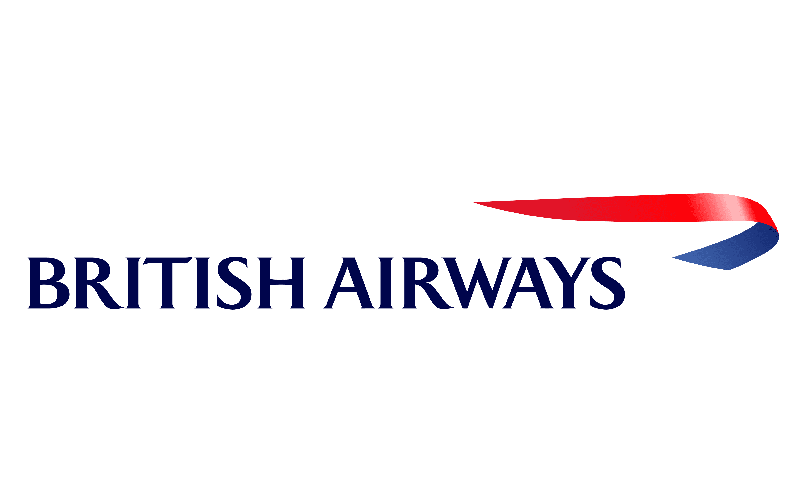

# British Airways Review Analysis ✈️📝


This project involves **web scraping**, **data cleaning**, and **sentiment analysis** of customer reviews for British Airways from [Skytrax](https://www.airlinequality.com/airline-reviews/british-airways). 

It demonstrates a full cycle of data collection to analysis using Python libraries such as `BeautifulSoup`, `pandas`, and `vaderSentiment`.

---

## Task 1

---

## 📁 Project Structure

```
├── getting_started_uncleaned.ipynb   # Web scraping raw reviews
├── getting_started_cleaned.ipynb     # Data cleaning + sentiment analysis
├── BA_reviews.csv                    # Output cleaned dataset
└── README.md                         # Project description
```

---

## 🔎 Features

### 1. Web Scraping
- Collects British Airways reviews (up to N pages)
- Extracts:
  - Review text
  - Date
  - Country
  - Rating

### 2. Data Cleaning
- Removes boilerplate text and formatting
- Extracts "Trip Verified" status
- Parses date formats

### 3. Sentiment Analysis
- Uses VADER sentiment analyzer
- Computes compound score
- Classifies into:
  - Positive
  - Neutral
  - Negative

---

## 📊 Sample Output

| review_snippet       | verified | rating | sentiment_score | analysis |
|----------------------|----------|--------|------------------|----------|
| Great flight overall | Yes      | 8      | 0.71             | Positive |
| Delayed and crowded  | No       | 2      | -0.45            | Negative |

---

## Task 2

---


# Airline Customer Booking Prediction 🧾✈️

This project builds predictive models to determine the likelihood of a customer booking a flight. It walks through a complete data science workflow—starting from cleaning raw customer data to building and comparing machine learning models.

---

## 📑 Table of Contents

1. [Problem Statement](#problem-statement)
2. [Dataset](#dataset)
3. [Approach](#approach)
4. [Models Used](#models-used)
5. [Results](#results)
6. [Conclusion](#conclusion)

---

## 📌 Problem Statement

In the airline industry, ensuring consistent customer bookings is crucial. This project aims to use customer data to predict if a user will book a ticket.

---


## 📂 Dataset

The dataset contains customer reviews, trip details, and feedback features. It is cleaned and preprocessed to make it suitable for model training.

---

## 🧠 Approach

1. **Data Cleaning**
   - Remove unwanted columns
   - Treat missing values
   - Handle duplicates

2. **EDA**
   - Visualize distributions
   - Analyze relationships and outliers

3. **Feature Engineering**
   - Encode categorical variables
   - Normalize numerical data

4. **Modeling**
   - Logistic Regression
   - Decision Tree
   - Random Forest
   - K-Nearest Neighbors (KNN)

5. **Balancing Dataset**
   - Applied techniques to handle class imbalance (like SMOTE)

---

## 🤖 Models Used

| Model              | Accuracy | Precision | Recall |
|-------------------|----------|----------|-----|
| Logistic Regression | 58.09%      | 57.35%      | 60.91%  |
| Decision Tree       | 55.17%      | 53.68%      | 71.05%  |
| *Random Forest*      |*61.73%*      | *61.45%*     | *61.54%*  |
| KNN                 | 56.71%      | 57.94%      | 46.86%  |


---

## ✅ Conclusion

- Class balancing significantly improved model performance.
- Random Forest yielded the best results on the balanced dataset.
- This solution can assist airlines in better targeting customers likely to book flights.


## 🧑‍💻 Technologies & Tools Used

[](https://skillicons.dev)


